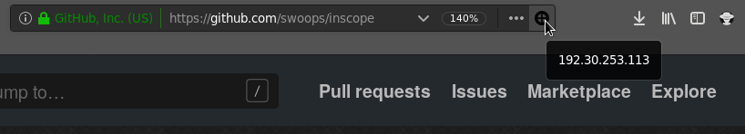

# inscope

Firefox Extension using Native Messaging to get a website's IP address and check
it against a scope file.

## Why?
Web extensions (add-ons) are written in JavaScript which can't resolve DNS.
Most extensions get around this by the following: When a user visits a site,
the extension sends the website's URL to an API server via an HTTP request. The
API server then resolves the recieved URL's IP address and replies with it.

This results in the API server's ability to track the user. Every website the
user visits is sent to the API server. If the user visits an internal site, the
internal naming convention will be exposed to the API server. Additionally, the
external server will lack access to the internal DNS server and fail to resolve
the domain properly.

In contrast, inscope uses Firefox's [Native Messaging
API](https://developer.mozilla.org/en-US/docs/Mozilla/Add-ons/WebExtensions/Native_messaging)
to send the domain names to a Python script running locally on the user's
system. That script just calls `socket.gethostbyname`. The web browser has
already resolved the domain name, so the system should still have it in the
cache. This results in an increase in speed and privacy.

The only downside of Native Messaging is a slightly more complicated
installation process.

## Is it in scope
Just installing inscope lets you quickly get the IP address of a website on
mouseover of the inscope icon.

If you create a `/tmp/ff_scope` file containing a new line separated list of IP
addresses. When the Python script resolves an IP, it will check if that IP is
in the provided list. If so it will make the inscope icon turn green 
. Otherwise it will be red 
. If the `/tmp/ff_scope` file is
updated, clicking the inscope icon will tell it to re-parse the file.

## Usability
This is still very new. Pull requests or notifications of issues are welcome.

## Installation
There are two parts to the installation. The web extension must be added to
Firefox. Then Firefox must be notified where the native application is located.

### Install Web Extension
Add the .xpi file to Firefox, which is explained
[here](https://developer.mozilla.org/en-US/docs/Mozilla/Add-ons/WebExtensions/Distribution_options/Sideloading_add-ons#Using_Install_Add-on_From_File).

### Instal Native Application

1. Move `src/app/inscope.py` to a desired location. For security the directory
should not be world writable. Ensure the file permissions are set to
executable.

2. Move the manifest file from `src/app/inscope.json` to a directory in which
Firefox will look. See [Firefox documentation](https://developer.mozilla.org/en-US/docs/Mozilla/Add-ons/WebExtensions/Native_manifests#Manifest_location)

4. Replace the `path` variable in the manifest file (`src/app/inscope.json`)
with the full path to the Python script (`inscope.py`)

5. Reload the extension in Firefox and check the console for errors.

The `install.sh` script was written to do the Native Application install, on
Linux, the way *I* like it. It should be reviewed before running; it may not be
ideal for your use case.
